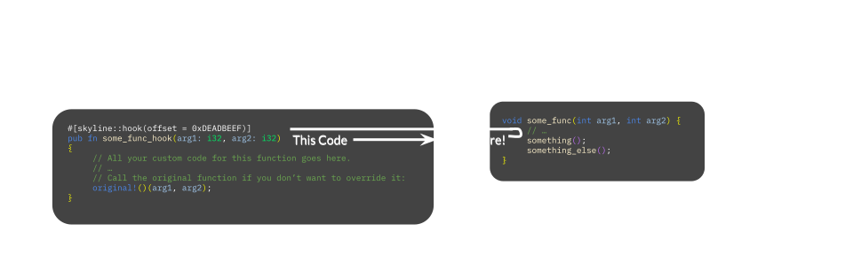
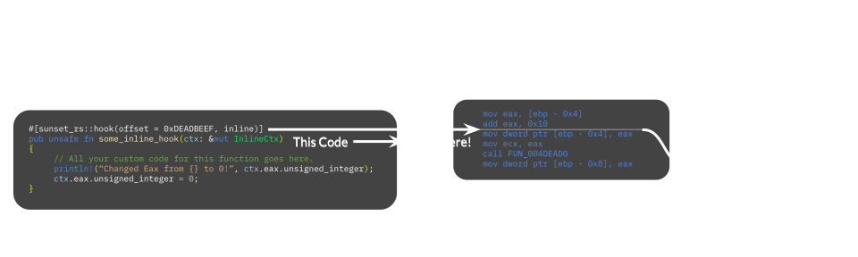

# Intro to Function Hooking

Function hooking refers to the concept of modifying the behavior/logic function in another executable through inserting bits of code to yield control to some *other* function; enabling the development of patches both big and small to already compiled code.

There are two main types of function hooks we use: Replacement and Inline. Replacement hooks are simpler than inline hooks, allowing us replace a funtion entirely while retaining the ability to **call the original function that we replaced**. These hooks are often used when we either want to completely replace/reimplement a function, or meddle with the arguments passed to it before yielding control back to the game.

This graphic, courtesy of the Super Smash Bros. Ultimate modding scene, should help demonstrate visusally what we mean by this.

In this example, our code runs first, as the call to the original function (denoted by the invokation of the `original!` macro) occurs at the end of the hook.

Inline hooks work quite a bit differently from replacement hooks. They allow us to just insert our own code right *in the middle* of an existing function, removing the need to reimplement all the logic ourselves. Inline hooks are typically used to grab or quickly change the contents of a local variable or register at *just* the right moment. Here's another graphic for clarity:

